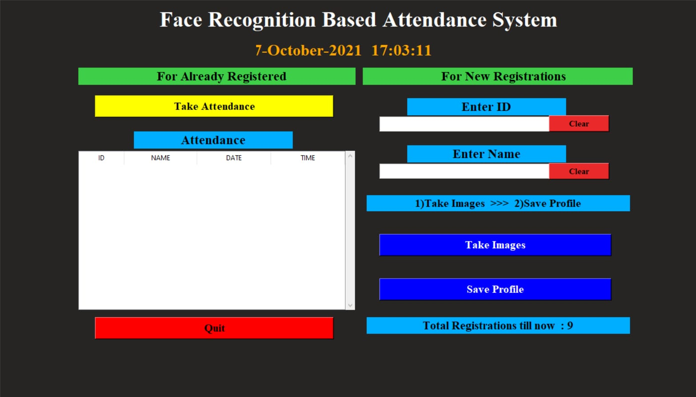
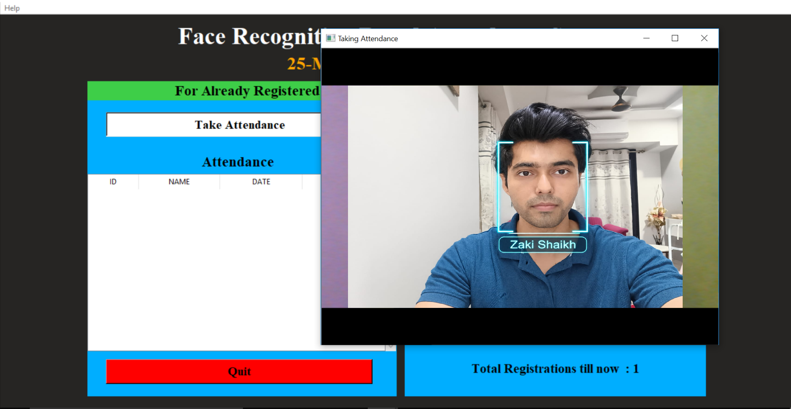
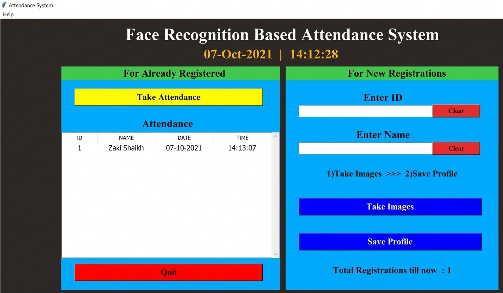
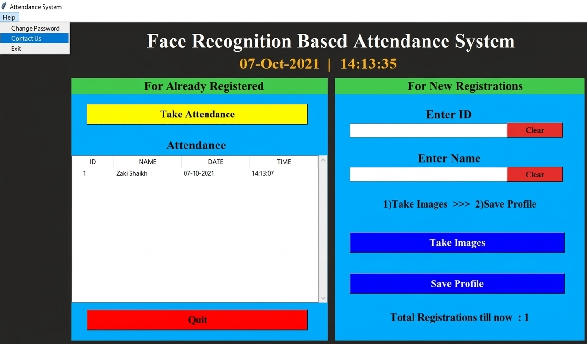

# Face Recognition-Based Secure Attendance System

A Python-based attendance system that uses face recognition and a GUI to provide secure and automated attendance management.

## CYBERSECURITY FOCUS

The system helps protect against common attendance-related threats such as:

- **Proxy Attendance** – Face recognition verifies the person before marking attendance.
- **Unauthorized Registration** – New users require password authentication.
- **Identity Impersonation** – Attendance is linked to the registered face.
- **Record Tracking** – Attendance is automatically stored with ID, name, date, and time.
- **Auditability** – Daily attendance records can be reviewed for verification.

## TECHNOLOGY USED

1. **Python & Tkinter** – GUI
2. **OpenCV & LBPH** – Face detection and recognition
3. **CSV, NumPy & Pandas** – Data and attendance management
4. **Datetime** – Attendance timestamps

## SECURITY FEATURES

- Face-based identity verification
- Password-protected registration
- Automated attendance logging
- Daily attendance records
- Reduced risk of proxy attendance

## FUTURE SECURITY ENHANCEMENTS

- Liveness detection to prevent photo/video spoofing
- Encrypted storage
- Secure database instead of CSV
- Password hashing
- File-integrity monitoring
- Security event logging

### For more information:

https://machinelearningprojects.net/how-to-perform-face-recognition-using-knn/

# SCREENSHOTS

MAIN SCREEN:

TAKING ATTENDANCE:

SHOWING ATTENDANCE TAKEN:

HELP OPTION IN MENUBAR:

Thank You for Trusting our Attendance system to avoid any vulnerable person to enter the class!
